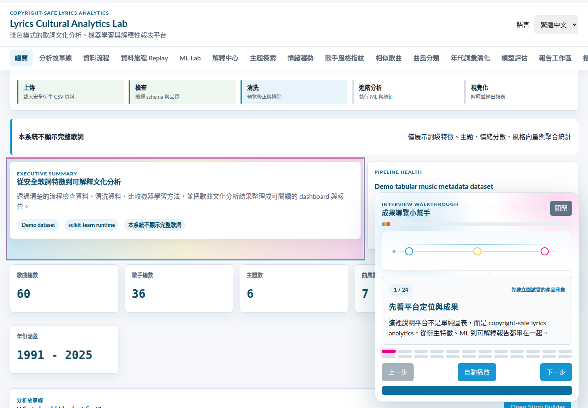
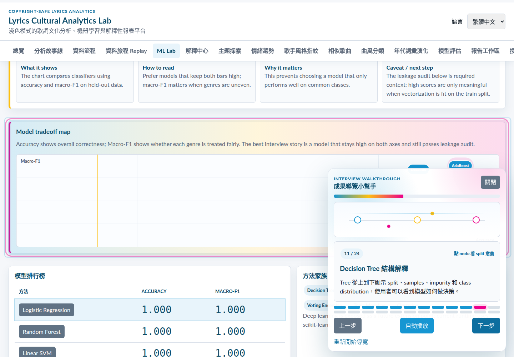
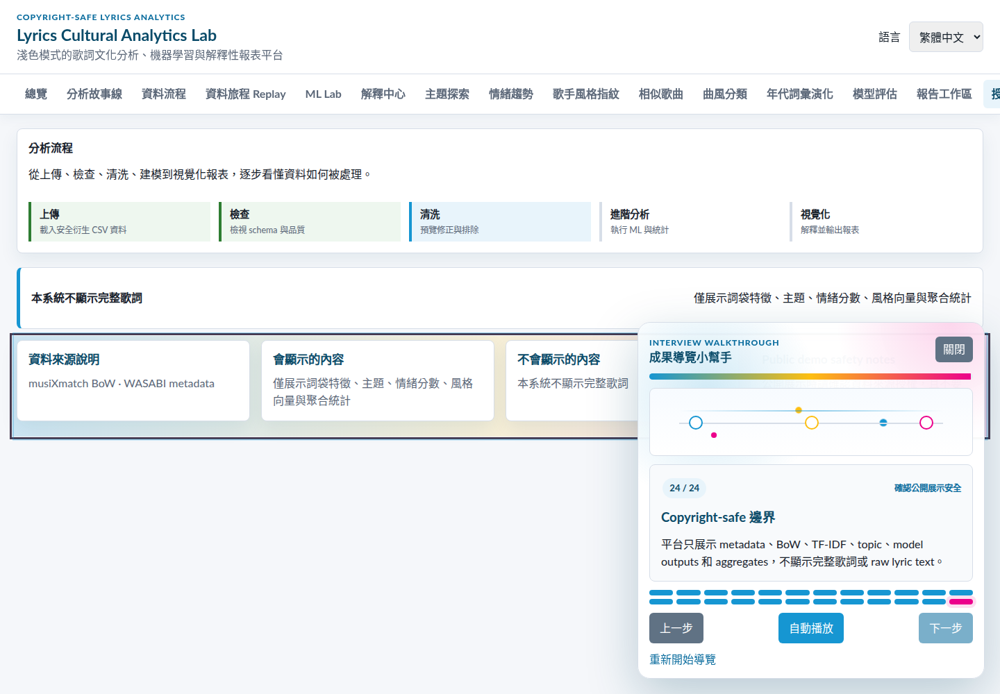
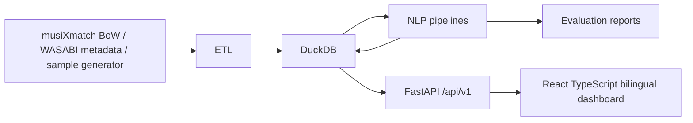

# Lyrics Cultural Analytics Lab

Lyrics Cultural Analytics Lab 是一個淺色模式的歌詞文化分析與機器學習解釋平台。它把 copyright-safe metadata、BoW features、TF-IDF、topic modeling、相似度、分類模型與視覺化報表整合成可追蹤 workflow，不公開完整歌詞，只使用 metadata、BoW features、模型輸出與聚合結果。

## Project Overview

This monorepo is a runnable data product, not a notebook-only analysis. It provides a FastAPI backend, DuckDB feature store, scikit-learn analysis endpoints, evaluation scripts, and a bilingual React TypeScript dashboard.

## UI Design System

The frontend follows a light professional analytics theme inspired by Geckoboard, Tableau, Urban Institute, and Berkeley data visualization guidance:

- Color tokens live in `frontend/src/styles/tokens.css`.
- Primary blue: `#1696D2`; dark heading/nav ink: `#0A4B69`; page background: `#F5F7FA`; panel background: `#FFFFFF`.
- Accent colors are limited to yellow `#FDBF11` and magenta `#EC008B`; categorical charts should stay at six colors or fewer.
- Typography uses a sans-serif stack with numeric metrics in monospace.
- Layout primitives live in `layout.css`, component styling in `components.css`, and visualization styling in `charts.css`.
- Pages use an executive-summary pattern: top-left KPI/summary, adjacent status context, then supporting analysis cards and charts.

Current redesign review screenshots:

- `docs/screenshots/overview-redesign.png`
- `docs/screenshots/workflow-redesign.png`
- `docs/screenshots/ml-lab-redesign.png`
- `docs/screenshots/ml-lab-visual-upgrade.png`
- `docs/screenshots/evaluation-visual-upgrade.png`
- `docs/screenshots/genre-classifier-visual-upgrade.png`
- `docs/screenshots/similar-songs-visual-upgrade.png`
- `docs/screenshots/artist-style-visual-upgrade.png`
- `docs/screenshots/workflow-journey.png`
- `docs/screenshots/ml-lab-journey.png`
- `docs/screenshots/evaluation-journey.png`
- `docs/screenshots/workflow-journey-v2.png`
- `docs/screenshots/ml-lab-journey-v2.png`
- `docs/screenshots/evaluation-journey-v2.png`

## Guided Assistant Demo

The app now includes a floating guided assistant for interview/demo walkthroughs. It opens as an app-style panel, jumps to the relevant page and chart, highlights the active analysis region, and explains the meaning of each step in Traditional Chinese by default with English available from the language switcher.

The guided walkthrough covers 24 steps:

- product overview and story builder
- upload/sample dataset workflow
- schema inspection, cleaning, TF-IDF, model comparison, tree, clustering, and tradeoff explanation
- explainability center and model disagreement
- similar-song network, artist network, artist fingerprint
- evaluation path, confusion matrix, error storyline
- report workspace and licensing safety

Playwright validation artifacts:

- Full guided-tour recording: `docs/videos/guided-tour.webm`
- Step-by-step screenshots: `docs/screenshots/guided-tour/step-01.png` through `docs/screenshots/guided-tour/step-24.png`

Representative screens:





To regenerate the screenshots and recording locally:

```bash
make api
make frontend
cd frontend
npm run test:e2e -- src/tests/e2e/guided-tour.spec.ts
```

## Why Copyright-Safe Lyric Analytics Matters

Lyric analytics is useful for cultural trend research, music metadata enrichment, and recommender systems. Public demos should avoid redistributing protected text, so this project exposes only metadata, bag-of-words features, model outputs, vectors, and aggregates.

## Dataset and Licensing Notes

Primary supported sources are musiXmatch BoW and WASABI metadata. When real data is unavailable, `make sample-data` creates realistic local derived-feature samples without complete lyric text.

## No Full Lyrics Policy

No API response, frontend mock, test fixture, sample dataset, or demo UI may include complete lyrics, raw lyric text, or line-by-line lyrics. Backend safety tests fail if forbidden lyric text fields appear in sample files or song-related API responses.

## Architecture



## Backend API Endpoints

- Health: `GET /api/v1/health`
- Datasets: upload a safe derived CSV bundle with `POST /api/v1/datasets/upload`
- Songs: search, detail, similar songs, topics, sentiment
- Artists: search, profile, songs, style fingerprint
- Analytics: overview, workflow profile, topics, sentiment trends, yearly terms, genres, languages
- Analysis Platform: story builder, explainability center, data lineage replay, report generation, classification comparison, clustering, TF-IDF, and topic modeling summaries
- Models: genre prediction and evaluation summary
- Safety: policy and audit

## React Frontend Pages

The UI includes Overview, Analysis Stories, Data Workflow, Data Journey Replay, ML Lab, Explainability Center, Topic Explorer, Sentiment Trends, Artist Style Fingerprint, Similar Songs, Genre Classifier, Cultural Timeline, Evaluation, Report Workspace, and Licensing pages.

## Bilingual UI Support

Default language is Traditional Chinese `zh-TW`. Users can switch to English `en-US`; the selection is stored in localStorage. UI strings live in `frontend/src/i18n/locales/`.

## Data Pipeline

Run `make sample-data`, `make train`, `make evaluate`, and `make etl` to generate safe sample data, derived model outputs, metrics, and DuckDB tables.

The web app also includes a session dataset flow. Upload `artists.csv`, `songs.csv`, and `lyric_bow_features.csv`; the backend validates that no raw lyric columns are present, creates a temporary `dataset_id`, and runs the same preparation, model, evaluation, and quality-report steps. If no dataset is uploaded, the UI uses the sample dataset. Upload responses include a processing timeline for Validation, Cleaning, Feature generation, Training, and Evaluation, plus readable fix suggestions when validation fails.

The dashboard journey overlay lets users follow the data from Upload to Clean, TF-IDF, Model, and Report. Each step includes animated data-flow particles, before/after mini visuals, page navigation, chart highlighting, and short teaching copy so the analysis process is visible instead of only summarized as final metrics.

Analysis Story Builder turns metrics into evidence-linked insight cards with severity, confidence, and next actions. Explainability Center compares feature importance, signed linear terms, per-class behavior, model disagreement, and error cases. Data Journey Replay follows one song through metadata, validation, cleaning, BoW, TF-IDF, topics, prediction, and report output. Report Workspace produces safe Markdown and print-friendly HTML reports.

For the complete local preparation workflow, run:

```bash
make data-ready
```

For licensed external files, provide normalized derived-feature CSVs locally and run the backend `prepare_data` module with `--input-dir`. The validator rejects raw lyric columns before training or ETL.

You can also run:

```bash
make import-data INPUT=/absolute/path/to/safe-derived-csv
```

This maps common musiXmatch/WASABI-style aliases, validates safety, trains/evaluates, writes a data quality report, and loads DuckDB.

## NLP Pipeline

The MVP includes TF-IDF feature construction, NMF topic modeling, proxy sentiment scoring, logistic regression, decision tree, random forest, linear SVM, gradient boosting, AdaBoost, voting ensemble, clustering, cosine similarity, yearly term trends, and artist-level style fingerprints. The ML Lab visualizes tree structures with clickable node explanations, cluster profiles with representative songs, top terms, topic mix, and contrast terms, and model comparison charts for baseline and ensemble methods.

Classification evaluation uses a split-first scikit-learn pipeline: TF-IDF is fit only on the training split, then the held-out split is transformed with the train vocabulary. Interactive genre prediction is labeled as demo inference because it uses a separate full-demo fitted model for user-adjustable feature vectors.

## Evaluation Metrics

Evaluation reports include accuracy, macro-F1, Recall@K, nDCG@K, simplified topic coherence, and no-raw-lyrics safety audit status.
The dashboard also shows confusion matrix, per-genre metrics, retrieval examples, and an error-case storyline explaining which genres are confused, why the issue matters, and how to improve the data or model.

## How to Run Locally

```bash
make install
make data-ready
make import-fixture
make test
make test-e2e
```

## How to Run Backend

```bash
make api
```

FastAPI runs at `http://localhost:8000`.

## How to Run Frontend

```bash
make frontend
```

Vite runs at `http://localhost:5173`.

## Limitations

The included models are MVP baselines for product demonstration. Replace sample data with properly licensed BoW and metadata before research or production use.

## Resume Bullets

中文：

- 建立 copyright-safe 歌詞 NLP 資料產品，使用 FastAPI、DuckDB 與 React TypeScript 呈現主題、情緒、相似度與文化趨勢分析。
- 設計不公開完整歌詞的資料與 API 安全邊界，透過 pytest 驗證 sample data 與 response 不含 raw lyric 欄位。
- 實作 bilingual zh-TW/en-US dashboard，支援模型評估、歌手風格指紋、曲風分類與年代詞彙演化。

English:

- Built a copyright-safe lyrics NLP data product with FastAPI, DuckDB, and React TypeScript for topic, sentiment, similarity, and cultural trend analytics.
- Designed API and data safety boundaries that expose derived features only, with pytest coverage for forbidden raw lyric fields.
- Implemented a bilingual zh-TW/en-US dashboard covering evaluation, artist style fingerprints, genre classification, and yearly term evolution.
