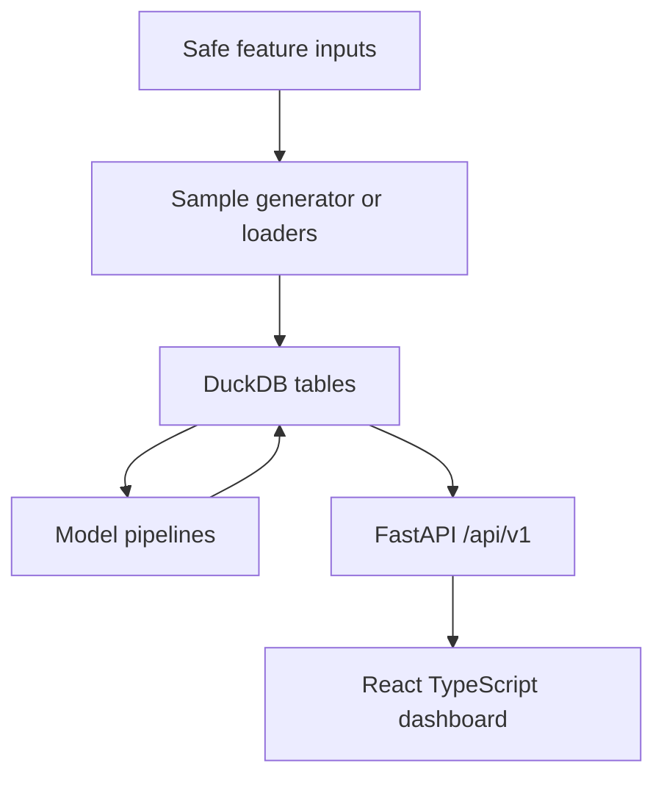

# Architecture

The project is a frontend/backend monorepo.

The backend owns ingestion, feature generation, modeling, evaluation, and API contracts. The frontend owns bilingual presentation, filters, charts, search, and copyright-safety notices.
